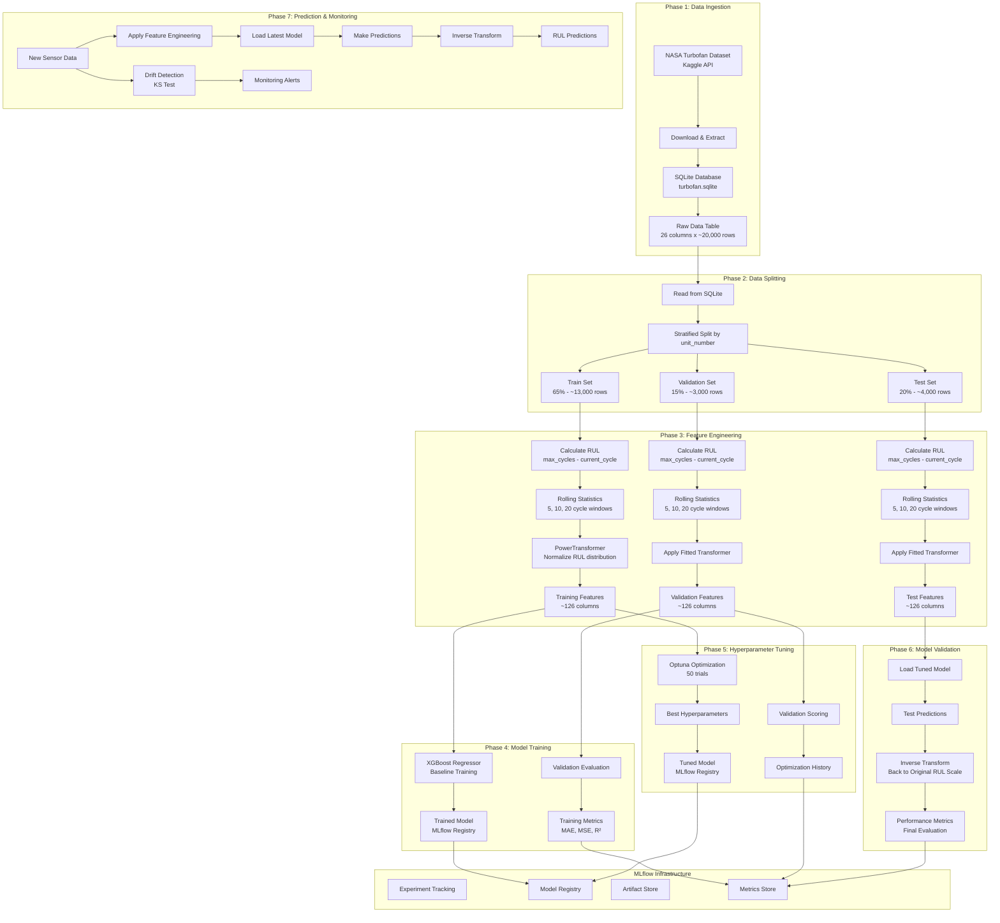

# Data Flow Diagram: MLOps Pipeline

## 🔄 Complete Data Flow Architecture



## 📊 Data Transformation Details

### Raw Data Structure (26 columns)
```
Input Features:
├── unit_number          (Engine ID)
├── time_in_cycles       (Operating cycle)
├── operational_setting_1 (Flight condition)
├── operational_setting_2 (Flight condition)
├── operational_setting_3 (Flight condition)
├── sensor_1             (Fan inlet temperature)
├── sensor_2             (LPC outlet temperature)
├── sensor_3             (HPC outlet temperature)
├── sensor_4             (LPT outlet temperature)
├── sensor_5             (Fan inlet pressure)
├── sensor_6             (Bypass ratio)
├── sensor_7             (HPC efficiency)
├── sensor_8             (HPC efficiency)
├── sensor_9             (HPT efficiency)
├── sensor_10            (LPT efficiency)
├── sensor_11            (Engine efficiency)
├── sensor_12            (Fuel flow)
├── sensor_13            (Corrected fan speed)
├── sensor_14            (Corrected core speed)
├── sensor_15            (Engine pressure ratio)
├── sensor_16            (Static pressure)
├── sensor_17            (Fuel metering valve)
├── sensor_18            (Corrected fan speed)
├── sensor_19            (Corrected core speed)
├── sensor_20            (Bypass ratio)
└── sensor_21            (Bleed valve)
```

### Feature Engineering Output (~126 columns)
```
Engineered Features:
├── Original Sensors (21 features)
│   ├── sensor_1, sensor_2, ..., sensor_21
│
├── Rolling Means (63 features)
│   ├── sensor_1_mean_5, sensor_1_mean_10, sensor_1_mean_20
│   ├── sensor_2_mean_5, sensor_2_mean_10, sensor_2_mean_20
│   └── ... (for all 21 sensors)
│
├── Rolling Std Deviations (63 features)
│   ├── sensor_1_std_5, sensor_1_std_10, sensor_1_std_20
│   ├── sensor_2_std_5, sensor_2_std_10, sensor_2_std_20
│   └── ... (for all 21 sensors)
│
├── Operational Settings (3 features)
│   ├── operational_setting_1
│   ├── operational_setting_2
│   └── operational_setting_3
│
└── Target Variable (1 feature)
    └── RUL (Remaining Useful Life)
```

### Data Split Sizes
```
Dataset Distribution:
├── Training Set: 65% (~13,000 rows)
├── Validation Set: 15% (~3,000 rows)
└── Test Set: 20% (~4,000 rows)

Total: ~20,000 time series observations
Units: ~100 turbofan engines
```

## 🎯 Sample Data Examples

### Raw Data Sample
```csv
unit_number,time_in_cycles,operational_setting_1,operational_setting_2,operational_setting_3,sensor_1,sensor_2,...
1,1,-0.0007,0.0019,100.0,518.67,641.82,1589.70,1400.60,14.62,21.61,553.36,2388.06,9046.19
1,2,-0.0004,0.0000,100.0,518.67,642.15,1591.82,1403.14,14.62,21.61,553.75,2388.04,9044.07
1,3,0.0016,0.0006,100.0,518.67,642.35,1587.99,1404.20,14.62,21.61,554.26,2388.08,9052.94
```

### Feature Engineering Sample
```csv
unit_number,sensor_1,sensor_1_mean_5,sensor_1_mean_10,sensor_1_mean_20,sensor_1_std_5,sensor_1_std_10,sensor_1_std_20,...,RUL
1,518.67,518.67,518.67,518.67,0.0,0.0,0.0,...,191
1,518.67,518.67,518.67,518.67,0.0,0.0,0.0,...,190
1,518.67,518.67,518.67,518.67,0.0,0.0,0.0,...,189
```

### Model Predictions Sample
```csv
unit_number,time_in_cycles,predicted_RUL,actual_RUL,error
1,1,188.45,191,2.55
1,2,187.23,190,2.77
1,3,186.01,189,2.99
```

## 🔄 Data Processing Pipeline

### Step 1: RUL Calculation
```python
# For each engine unit
max_cycles = df.groupby('unit_number')['time_in_cycles'].max()
df['RUL'] = df.apply(lambda row: 
    max_cycles[row['unit_number']] - row['time_in_cycles'], axis=1)
```

### Step 2: Rolling Statistics
```python
# For each sensor and window size
windows = [5, 10, 20]
for sensor in sensor_columns:
    for window in windows:
        df[f'{sensor}_mean_{window}'] = df.groupby('unit_number')[sensor].rolling(window).mean()
        df[f'{sensor}_std_{window}'] = df.groupby('unit_number')[sensor].rolling(window).std()
```

### Step 3: Target Transformation
```python
# Apply PowerTransformer to normalize RUL distribution
from sklearn.preprocessing import PowerTransformer
transformer = PowerTransformer(method='yeo-johnson')
df['RUL_transformed'] = transformer.fit_transform(df[['RUL']])
```

### Step 4: Model Training Data Flow
```python
# Training flow
X_train = feature_engineered_train.drop(['RUL'], axis=1)
y_train = feature_engineered_train['RUL']
model = XGBRegressor(**params)
model.fit(X_train, y_train)
```

## 📊 Performance Metrics Flow

### Training Metrics
```
Training Phase:
├── MAE: Mean Absolute Error
├── MSE: Mean Squared Error
├── R²: R-squared score
├── RMSE: Root Mean Squared Error
└── Feature Importance: XGBoost importance scores
```

### Validation Metrics
```
Validation Phase:
├── Cross-validation scores
├── Hyperparameter optimization history
├── Best parameter combinations
└── Optimization convergence plots
```

### Test Metrics (Final Evaluation)
```
Test Phase:
├── MSE: 2374.17
├── MAE: 36.49
├── R²: 0.49
└── Actual vs Predicted scatter plots
```

This comprehensive data flow shows how raw sensor data transforms through each phase into actionable RUL predictions, with proper validation and monitoring throughout the pipeline.