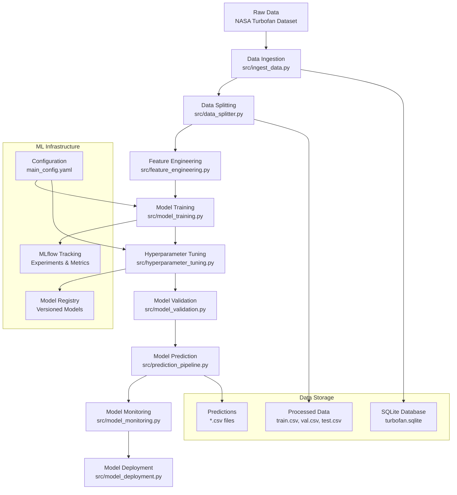

# MLOps Workflow Guide: Predictive Maintenance System

## 🎯 Project Overview

This project implements a complete MLOps pipeline for predictive maintenance of NASA Turbofan engines. The system predicts **Remaining Useful Life (RUL)** using sensor data to enable proactive maintenance scheduling.

## 📊 MLOps Pipeline Architecture



## 🔄 Phase-by-Phase Workflow

### Phase 1: Data Ingestion 📥
**File**: `src/ingest_data.py`
- **Purpose**: Download and load NASA Turbofan dataset
- **Input**: Kaggle API credentials
- **Output**: SQLite database (`turbofan.sqlite`)
- **Key Features**:
  - Downloads NASA CMAPS dataset
  - 26 columns: unit_number, time_in_cycles, 3 operational settings, 21 sensors
  - Stores in SQLite for efficient querying

### Phase 2: Data Splitting 🔄
**File**: `src/data_splitter.py`
- **Purpose**: Create train/validation/test splits
- **Input**: SQLite database
- **Output**: CSV files (train.csv, val.csv, test.csv)
- **Key Features**:
  - Stratified splitting by unit_number
  - 65% train, 15% validation, 20% test
  - Reproducible splits (random_state=42)

### Phase 3: Feature Engineering 🔧
**File**: `src/feature_engineering.py`
- **Purpose**: Transform raw sensor data into ML-ready features
- **Input**: Split CSV files
- **Output**: Feature-engineered DataFrames
- **Key Features**:
  - **RUL Calculation**: `max_cycles - current_cycle`
  - **Rolling Statistics**: 5, 10, 20-cycle windows for mean/std
  - **PowerTransformer**: Normalizes skewed RUL distribution
  - **Consistent Preprocessing**: Saves/loads fitted transformers

### Phase 4: Model Training 🏋️
**File**: `src/model_training.py`
- **Purpose**: Train baseline XGBoost regression model
- **Input**: Feature-engineered training data
- **Output**: Trained model in MLflow registry
- **Key Features**:
  - XGBoost regressor for RUL prediction
  - MLflow experiment tracking
  - Metrics: MAE, MSE, R²
  - Feature importance plots

### Phase 5: Hyperparameter Tuning 🎯
**File**: `src/hyperparameter_tuning.py`
- **Purpose**: Optimize model hyperparameters
- **Input**: Same training data
- **Output**: Optimized model
- **Key Features**:
  - Optuna Bayesian optimization
  - 50 trials with TPE sampler
  - Nested MLflow runs
  - Optimization visualization

### Phase 6: Model Prediction 🔮
**File**: `src/prediction_pipeline.py`
- **Purpose**: Make predictions on new data
- **Input**: New sensor data CSV
- **Output**: Predictions with RUL values
- **Key Features**:
  - Loads latest tuned model
  - Applies same feature engineering
  - Inverse transforms predictions

### Phase 7: Model Validation 📊
**File**: `src/model_validation.py`
- **Purpose**: Evaluate model on test set
- **Input**: Test data and trained model
- **Output**: Performance metrics and plots
- **Key Features**:
  - Unbiased performance assessment
  - Actual vs predicted scatter plots
  - Comprehensive metrics reporting

### Phase 8: Model Monitoring 📈
**File**: `src/model_monitoring.py`
- **Purpose**: Monitor for data drift and performance
- **Input**: New data vs reference data
- **Output**: Drift detection alerts
- **Key Features**:
  - Kolmogorov-Smirnov drift detection
  - Configurable drift thresholds
  - Performance monitoring

## 🗂️ Data Flow Summary

### Input Data Structure
```
Raw Sensor Data (NASA Turbofan):
- unit_number: Engine identifier
- time_in_cycles: Operating cycle
- operational_setting_1,2,3: Engine operational conditions
- sensor_1 to sensor_21: Various sensor readings
```

### Feature Engineering Output
```
Engineered Features:
- Original sensors (1-21)
- Rolling means (5, 10, 20 cycles)
- Rolling std deviations (5, 10, 20 cycles)
- RUL: Target variable (remaining useful life)
```

### Model Output
```
Predictions:
- Transformed RUL: Model prediction
- Original RUL: Inverse-transformed prediction
- Confidence intervals (if applicable)
```

## 🎛️ Configuration Management

The entire pipeline is controlled through `config/main_config.yaml`:

```yaml
data:
  test_size: 0.2        # Test split ratio
  val_size: 0.15        # Validation split ratio
  random_state: 42      # Reproducibility seed

model:
  name: "predictive_maintenance_model"
  params:
    objective: "reg:squarederror"
    n_estimators: 100
    learning_rate: 0.1

tuning:
  n_trials: 50          # Optimization trials
  objective_metric: "rmse"
  direction: "minimize"

monitoring:
  drift_threshold: 0.25  # Drift detection threshold
  r2_threshold: 0.7      # Performance threshold
```

## 📈 Key Performance Metrics

After hyperparameter tuning, the model achieves:
- **MSE**: 2374.17
- **MAE**: 36.49
- **R²**: 0.49

## 🚀 Quick Start Commands

```bash
# 1. Data ingestion
python -m src.ingest_data

# 2. Data splitting
python -m src.data_splitter

# 3. Feature Engineering
python -m src.feature_engineering

# 4. Train baseline model
python -m src.model_training

# 5. Hyperparameter tuning
python -m src.hyperparameter_tuning

# 6. Make predictions
python -m src.prediction_pipeline --input_csv data/processed/test.csv --output_csv predictions.csv

# 7. Validate model
python -m src.model_validation --predictions_path predictions.csv --ground_truth_path data/processed/test_ground_truth.csv

# 8. Run tests
pytest
```

## 🔍 Monitoring & Maintenance

The system includes continuous monitoring capabilities:
- **Data Drift Detection**: Statistical tests for distribution changes
- **Performance Monitoring**: R² score tracking
- **Alert System**: Configurable thresholds for automated alerts
- **Visualization**: Real-time plots for monitoring dashboards

## 📊 Next Steps for Enhanced User Experience

1. **Interactive Dashboards**: Add Streamlit/Dash visualization
2. **Automated Retraining**: Trigger retraining on drift detection
3. **API Deployment**: FastAPI endpoints for real-time predictions
4. **Enhanced Monitoring**: Add more sophisticated drift detection methods
5. **Documentation**: Jupyter notebooks with step-by-step examples